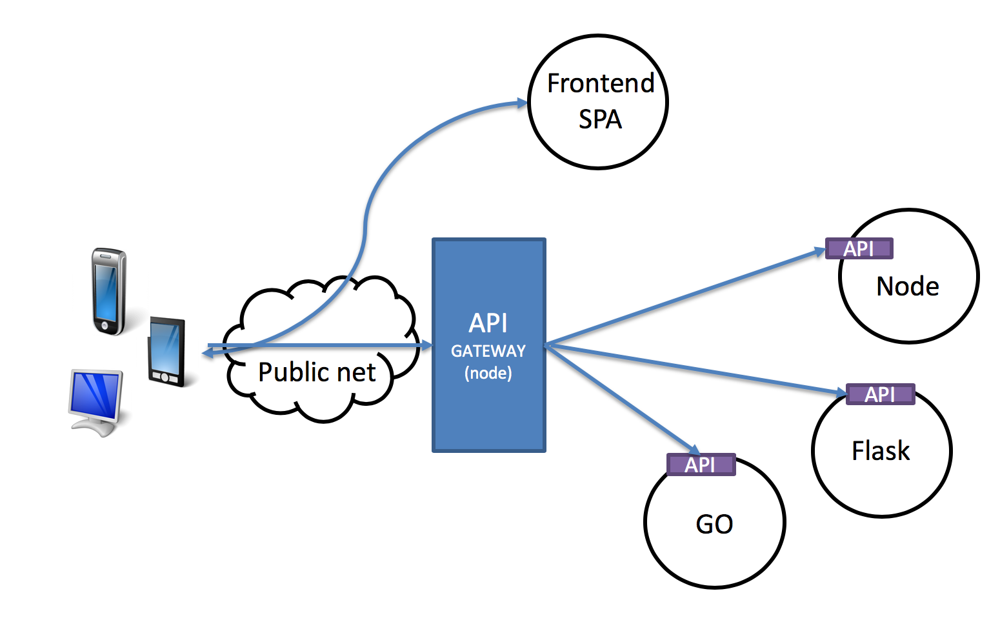

# Docker Project

## About

School assignment at LNU in course 1dv032 to set up simplified microserice architecture and dockerize some code projects (see screenshot below). The assignment included to set up a development environment with docker-compose and a production enviroment with Kubernetes to put the microservices up to LNUs Kubernetes cluster.

## Screenshot

## License

The license is MIT. You are free to do whatever you want with it.
